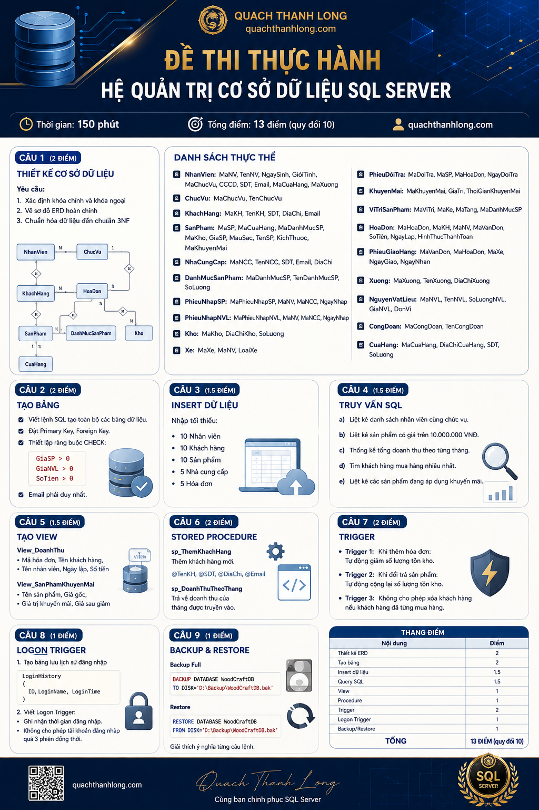

# ĐỀ THI THỰC HÀNH HỆ QUẢN TRỊ CƠ SỞ DỮ LIỆU SQL SERVER

## BỐI CẢNH

Công ty **WOODCRAFT Furniture** là doanh nghiệp chuyên sản xuất và kinh doanh nội thất gỗ cao cấp. Công ty sở hữu:

* Nhiều cửa hàng bán lẻ.
* Nhiều kho lưu trữ sản phẩm.
* Một xưởng sản xuất.
* Hệ thống giao hàng riêng.
* Chương trình khuyến mãi dành cho khách hàng.

Ban giám đốc yêu cầu xây dựng hệ thống cơ sở dữ liệu nhằm quản lý:

* Nhân viên
* Khách hàng
* Sản phẩm
* Nhà cung cấp
* Kho hàng
* Xưởng sản xuất
* Hóa đơn bán hàng
* Giao hàng
* Đổi trả
* Khuyến mãi

---

## SƠ ĐỒ NGHIỆP VỤ

<pre class="overflow-visible! px-0!" data-start="792" data-end="1391">

<pre class="cm-content q9tKkq_readonly m-0"><code>                     NHÀ CUNG CẤP
                            |
          ----------------------------------
          |                                |
   PHIẾU NHẬP NVL                 PHIẾU NHẬP SẢN PHẨM
          |                                |
          |                                |
     NGUYÊN VẬT LIỆU                  KHO HÀNG
          |
       XƯỞNG
          |
      CÔNG ĐOẠN
          |
      SẢN PHẨM
          |
    DANH MỤC SP
          |
      CỬA HÀNG
          |
      HÓA ĐƠN
          |
      KHÁCH HÀNG
          |
     GIAO HÀNG
          |
      XE GIAO</code></pre>

</pre>

---

# CÂU 1 (2 ĐIỂM)

## Thiết kế cơ sở dữ liệu

Cho các thực thể sau:

### NhanVien

| Thuộc tính   |
| -------------- |
| MaNV (PK)      |
| TenNV          |
| NgaySinh       |
| GioiTinh       |
| CCCD           |
| SDT            |
| Email          |
| MaChucVu (FK)  |
| MaCuaHang (FK) |
| MaXuong (FK)   |

### ChucVu

| Thuộc tính  |
| ------------- |
| MaChucVu (PK) |
| TenChucVu     |

### KhachHang

| Thuộc tính |
| ------------ |
| MaKH (PK)    |
| TenKH        |
| SDT          |
| DiaChi       |
| Email        |

### SanPham

| Thuộc tính     |
| ---------------- |
| MaSP (PK)        |
| TenSP            |
| GiaSP            |
| MauSac           |
| KichThuoc        |
| MaDanhMucSP (FK) |
| MaKho (FK)       |
| MaKhuyenMai (FK) |
| MaCuaHang (FK)   |

### NhaCungCap

| Thuộc tính |
| ------------ |
| MaNCC (PK)   |
| TenNCC       |
| SDT          |
| Email        |
| DiaChi       |

### DanhMucSanPham

| Thuộc tính     |
| ---------------- |
| MaDanhMucSP (PK) |
| TenDanhMucSP     |
| SoLuong          |

### Kho

| Thuộc tính |
| ------------ |
| MaKho (PK)   |
| DiaChiKho    |
| SoLuong      |

### HoaDon

| Thuộc tính      |
| ----------------- |
| MaHoaDon (PK)     |
| MaKH (FK)         |
| MaNV (FK)         |
| MaVanDon (FK)     |
| SoTien            |
| NgayLap           |
| HinhThucThanhToan |

### PhieuGiaoHang

| Thuộc tính  |
| ------------- |
| MaVanDon (PK) |
| MaHoaDon (FK) |
| MaXe (FK)     |
| NgayGiao      |
| NgayNhan      |

### Xe

| Thuộc tính |
| ------------ |
| MaXe (PK)    |
| LoaiXe       |
| MaNV (FK)    |

### KhuyenMai

| Thuộc tính      |
| ----------------- |
| MaKhuyenMai (PK)  |
| GiaTri            |
| ThoiGianKhuyenMai |

### PhieuDoiTra

| Thuộc tính  |
| ------------- |
| MaDoiTra (PK) |
| MaSP (FK)     |
| MaHoaDon (FK) |
| NgayDoiTra    |

### NguyenVatLieu

| Thuộc tính |
| ------------ |
| MaNVL (PK)   |
| TenNVL       |
| SoLuongNVL   |
| GiaNVL       |
| DonVi        |

### Xuong

| Thuộc tính |
| ------------ |
| MaXuong (PK) |
| TenXuong     |
| DiaChiXuong  |

### CongDoan

| Thuộc tính    |
| --------------- |
| MaCongDoan (PK) |
| TenCongDoan     |

### CuaHang

| Thuộc tính   |
| -------------- |
| MaCuaHang (PK) |
| DiaChiCuaHang  |
| SDT            |
| SoLuong        |

---

### Yêu cầu

1. Xác định khóa chính và khóa ngoại.
2. Vẽ sơ đồ ERD hoàn chỉnh.
3. Chuẩn hóa dữ liệu đến chuẩn 3NF.

---

# CÂU 2 (2 ĐIỂM)

Viết lệnh SQL tạo toàn bộ các bảng dữ liệu.

Yêu cầu:

* Đặt Primary Key.
* Đặt Foreign Key.
* Thiết lập ràng buộc CHECK:

<pre class="overflow-visible! px-0!" data-start="3497" data-end="3539">

<pre class="cm-content q9tKkq_readonly m-0"><code>GiaSP >0
GiaNVL >0
SoTien >0</code></pre>

</pre>

* Email phải duy nhất.

---

# CÂU 3 (1.5 ĐIỂM)

Nhập tối thiểu:

* 10 Nhân viên
* 10 Khách hàng
* 10 Sản phẩm
* 5 Nhà cung cấp
* 5 Hóa đơn

bằng câu lệnh INSERT.

---

# CÂU 4 (1.5 ĐIỂM)

Viết các truy vấn SQL sau:

### a)

Liệt kê danh sách nhân viên cùng chức vụ.

### b)

Liệt kê sản phẩm có giá trên 10.000.000 VNĐ.

### c)

Thống kê tổng doanh thu theo từng tháng.

### d)

Tìm khách hàng mua hàng nhiều nhất.

### e)

Liệt kê các sản phẩm đang áp dụng khuyến mãi.

---

# CÂU 5 (1.5 ĐIỂM)

Tạo VIEW:

### View_DoanhThu

Hiển thị:

<pre class="overflow-visible! px-0!" data-start="4079" data-end="4147">

<pre class="cm-content q9tKkq_readonly m-0"><code>Mã hóa đơn
Tên khách hàng
Tên nhân viên
Ngày lập
Số tiền</code></pre>

</pre>

---

### View_SanPhamKhuyenMai

Hiển thị:

<pre class="overflow-visible! px-0!" data-start="4192" data-end="4256">

<pre class="cm-content q9tKkq_readonly m-0"><code>Tên sản phẩm
Giá gốc
Giá trị khuyến mãi
Giá sau giảm</code></pre>

</pre>

---

# CÂU 6 (2 ĐIỂM)

Tạo Stored Procedure:

### sp_ThemKhachHang

Thêm khách hàng mới.

Tham số:

<pre class="overflow-visible! px-0!" data-start="4358" data-end="4395">

<pre class="cm-content q9tKkq_readonly m-0"><code>@TenKH
@SDT
@DiaChi
@Email</code></pre>

</pre>

---

### sp_DoanhThuTheoThang

Trả về doanh thu của tháng được truyền vào.

---

# CÂU 7 (2 ĐIỂM)

Tạo Trigger:

### Trigger 1

Khi thêm hóa đơn:

* Tự động giảm số lượng tồn kho.

---

### Trigger 2

Khi đổi trả sản phẩm:

* Tự động cộng lại số lượng tồn kho.

---

### Trigger 3

Không cho phép xóa khách hàng nếu khách hàng đã từng mua hàng.

---

# CÂU 8 (1 ĐIỂM)

## Logon Trigger

Công ty muốn giới hạn số lượng phiên đăng nhập SQL Server.

Yêu cầu:

1. Tạo bảng lưu lịch sử đăng nhập:

<pre class="overflow-visible! px-0!" data-start="4890" data-end="4954">

<pre class="cm-content q9tKkq_readonly m-0"><code>LoginHistory
(
    ID,
    LoginName,
    LoginTime
)</code></pre>

</pre>

2. Viết Logon Trigger:

* Ghi nhận thời gian đăng nhập.
* Không cho phép tài khoản đăng nhập quá 3 phiên đồng thời.

---

# CÂU 9 (1 ĐIỂM)

## Backup & Restore

Trình bày các câu lệnh:

### Backup Full

<pre class="overflow-visible! px-0!" data-start="5159" data-end="5233">

<pre class="cm-content q9tKkq_readonly m-0"><code>BACKUP DATABASE WoodCraftDB
TO DISK='D:\Backup\WoodCraftDB.bak'</code></pre>

</pre>

### Restore

<pre class="overflow-visible! px-0!" data-start="5248" data-end="5325">

<pre class="cm-content q9tKkq_readonly m-0"><code>RESTORE DATABASE WoodCraftDB
FROM DISK='D:\Backup\WoodCraftDB.bak'</code></pre>

</pre>

Giải thích ý nghĩa từng câu lệnh.

---

# THANG ĐIỂM

| Nội dung        | Điểm                              |
| ---------------- | ----------------------------------- |
| Thiết kế ERD   | 2                                   |
| Tạo bảng       | 2                                   |
| Insert dữ liệu | 1.5                                 |
| Query SQL        | 1.5                                 |
| View             | 1                                   |
| Procedure        | 1                                   |
| Trigger          | 2                                   |
| Logon Trigger    | 1                                   |
| Backup/Restore   | 1                                   |
| **Tổng**  | **13 điểm → quy đổi 10** |

Đây là dạng đề rất sát thực tế doanh nghiệp, bao phủ gần như toàn bộ nội dung SQL Server:  **ERD → DDL → DML → Query → View → Procedure → Trigger → Logon Trigger → Backup/Restore** , phù hợp cho bài thi cuối kỳ môn Cơ sở dữ liệu hoặc Hệ quản trị SQL Server.
